# 🎬 PlayHaven - Video Streaming Platform with User Subscription

**PlayHaven** is a feature-rich video streaming platform that allows users to explore, communicate, subscribe, and stream movies and TV shows. The platform supports secure video streaming using the **VidLink API**, and **Google Pay** is integrated for seamless user subscriptions. Backend APIs are testable via **Postman**, and **GitHub** is used for version control and collaboration.

---

## 🔧 Tech Stack

**Frontend:**
- React.js (with Vite)
- Tailwind CSS
- Axios
- VidLink API (for video streaming)
- OMDb API (for metadata)

**Backend:**
- Node.js + Express.js
- MongoDB + Mongoose
- JWT Authentication
- Socket.IO (Parallel Chating Across Users)
- Google Pay API (Payment gateway)

**Utilities:**
- GitHub for version control
- Postman for API testing

---

## ✨ Features

- 🔐 JWT-based user authentication (Sign Up / Sign In)
- 🎥 Stream high-quality movies & TV shows via VidLink
- 📄 Display movie/show metadata using OMDb API
- 💰 Subscription system with Google Pay
- 💬 Chat with other users in the platform

---

## 🖼️ Demo Images

Preview the PlayHaven UI with real screenshots:

| **Login Page** | **Home Page** |
|----------------|---------------|
| 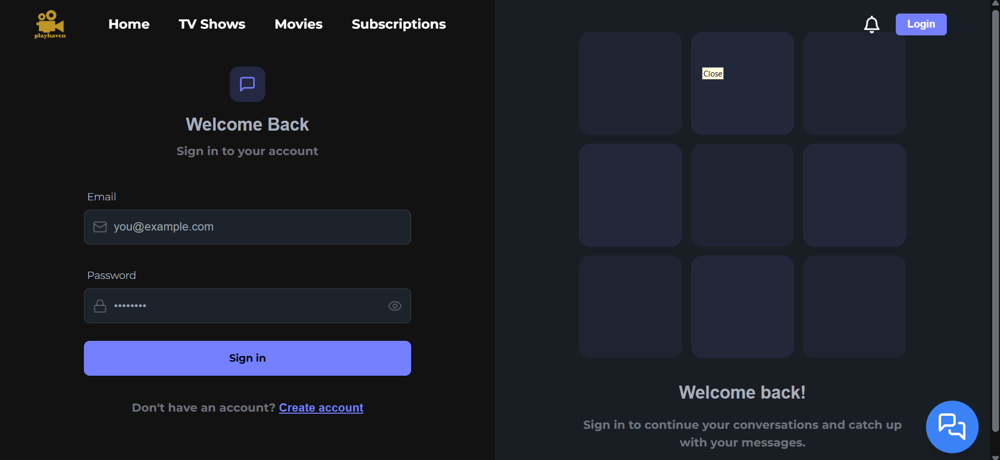 | 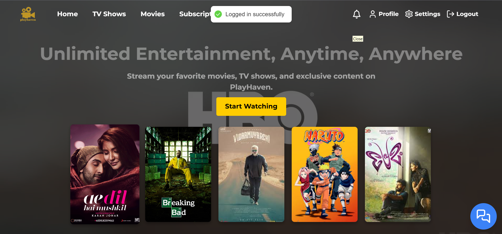 |

| **Movies Page** | **Movies Genre** |
|------------------|------------------|
| 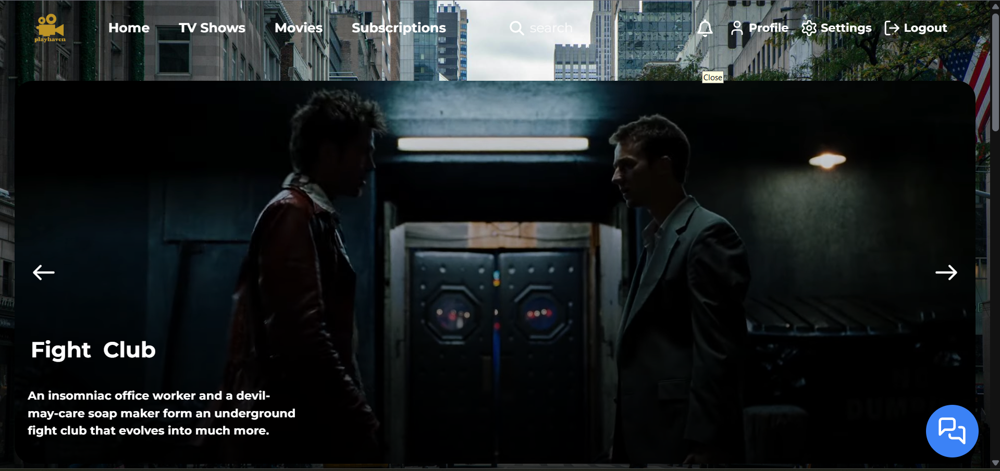 | 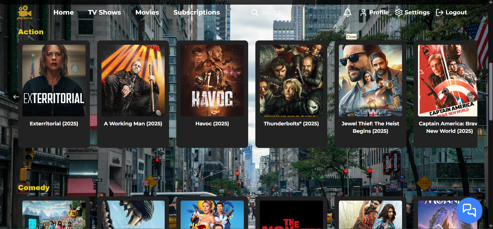 |

| **TV Shows Page** | **TV Shows Genre** |
|-------------------|--------------------|
| 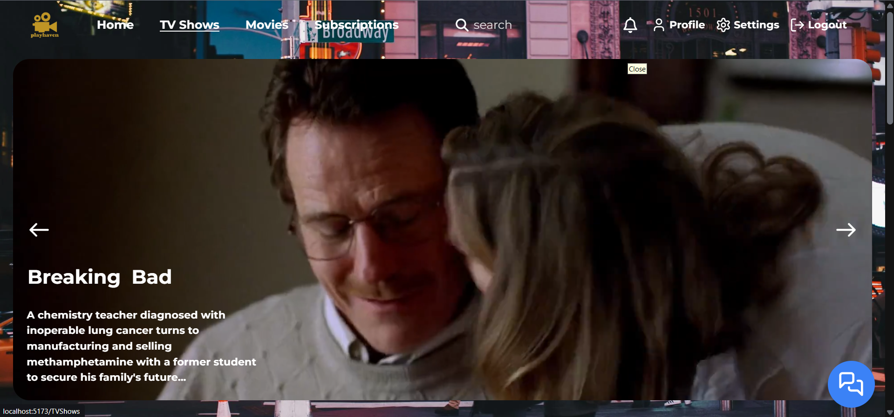 | 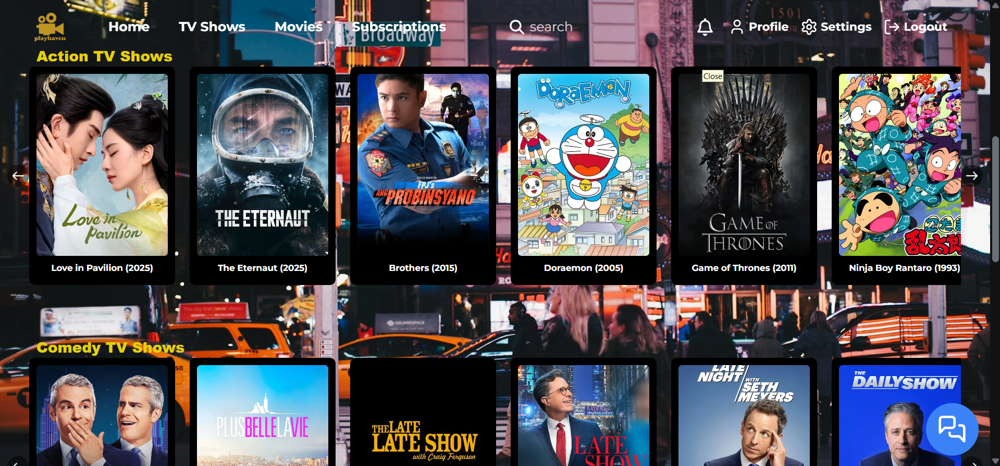 |

| **Details Page** | **Streaming Interface** |
|------------------|--------------------------|
| 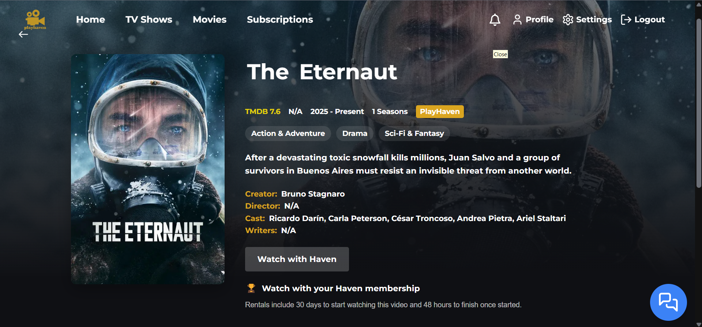 | 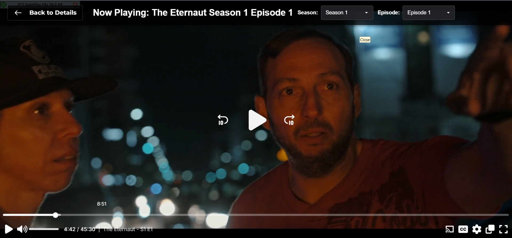 |

| **Subscription Page** | **Admin Dashboard** |
|------------------------|---------------------|
| 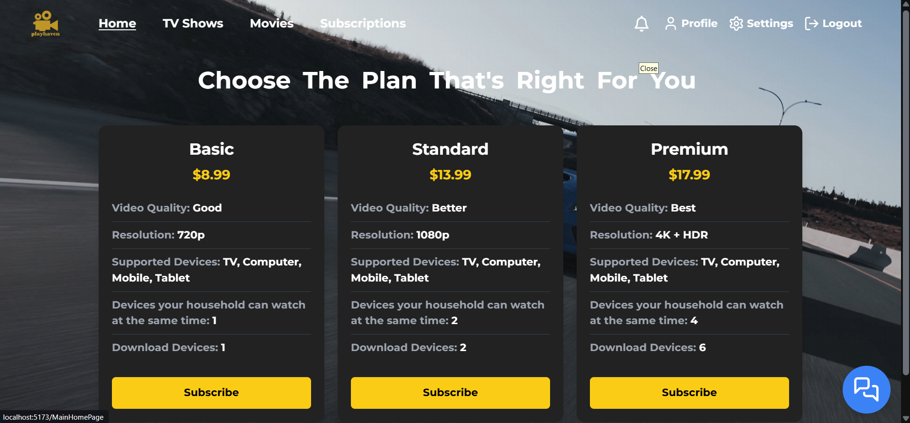 | 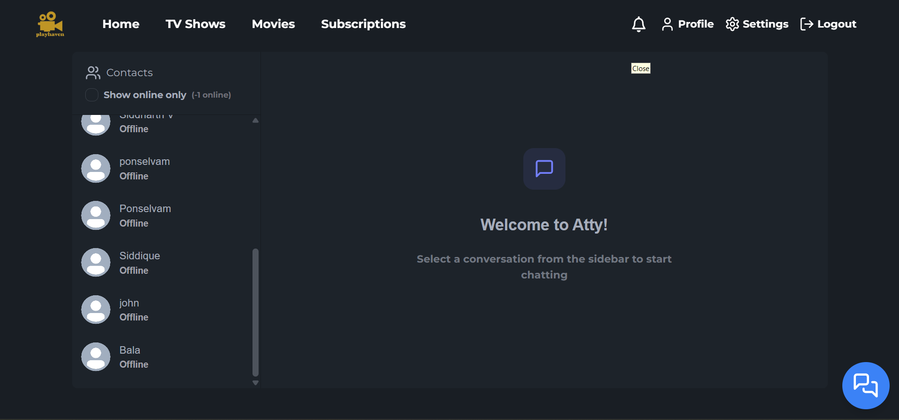 |

| **User UI** | **Account Page** |
|---------------|------------------|
| 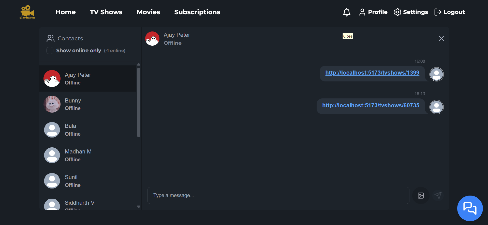 | 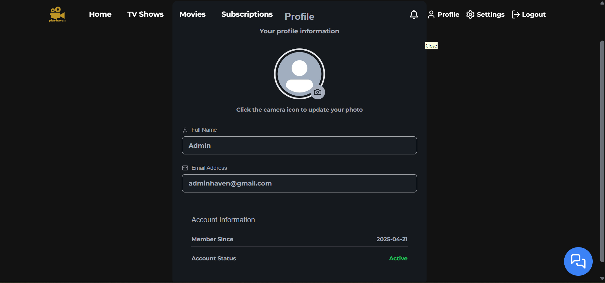 |

> 🗂️ All screenshots are located in the `/img/` folder.

---

## 👥 Collaborators
Thanks to the amazing team behind PlayHaven:

- [@Ajay Peter R](https://github.com/AjayPeter582)
- [@Hari Shankar Babu M](https://github.com/Bleeks-156)
- [@Pon Selvam S](https://github.com/ponselvam05)

---

